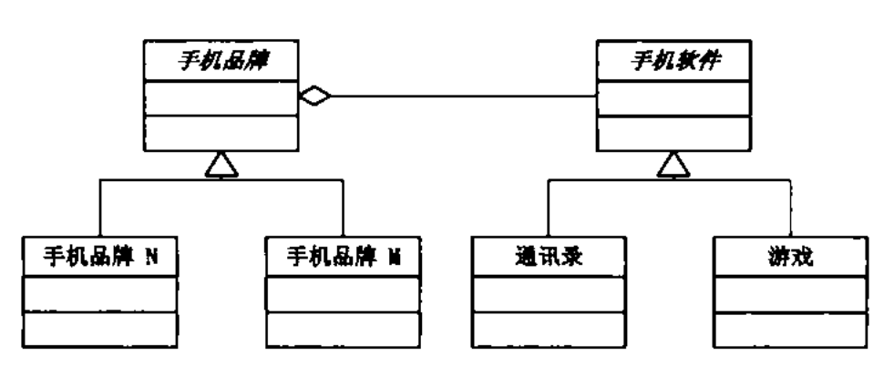

桥接模式
=======


对象的继承关系是在编译时就定义好了的，所以无法在运行时改变从父类继承的实现。子类的实现与它的父类有非常紧密的关系，以至于父类实现中的任何变化必然会导致子类发生变化。当需要复用子类时，如果继承下来的实现不适合解决新的问题，则父类必须重写或被其他更适合的类替换，这种依赖关系限制了 灵活性并且最终限制了复用性


```cpp
class Implementor{ // 手机软件
public:
    Implementor() {}
    ~Implementor() {}
    virtual void Operation();
}

class ConreteImplementorA: public Implementor{ // 手机软件A 
public:
    ConreteImplementorA() {}
    ~ConreteImplementorA() {}
    void Operation(){// my code}
}

class ConreteImplementorB: public Implementor{ // 手机软件B
public:
    ConreteImplementorB() {}
    ~ConreteImplementorB() {}
    void Operation(){// my code}
}

class Abstraction{ // 手机品牌
private:
    Implementor* _implementor;
public:
    Abstraction() {_implementor = nullptr;}
    ~Abstraction() {
        if(_implementor)
            delete _implementor;
    }

    void SetImplementor(Implementor* implementor){
        if(_implementor)
            delete _implementor;
        _implementor = implementor;
    }
    virtual void Operation() {
        _implementor->Operation();
    }
}

class RefinedAbstractionA: public Abstraction{ // 手机品牌N
public:
    RefinedAbstractionA() {}
    ~RefinedAbstractionA() {}

    void Operation() {
        _implementor->Operation();
    }
}

//
void main(){
    Abstraction* ab = new RefinedAbstractionA;
    ab->SetImplementor(new ConreteImplementorA);
    ab->Operation();

    ab->SetImplementor(new ConreteImplementorB);
    ab->Operation();
    delete ab;
}
```

实现系统可能有**多种角度分类**，每一种分类都有可能发生变化，如手机品牌和手机软件，那么把这种多角度分离出来让它们独立变化，可以减少它们之间的耦合
