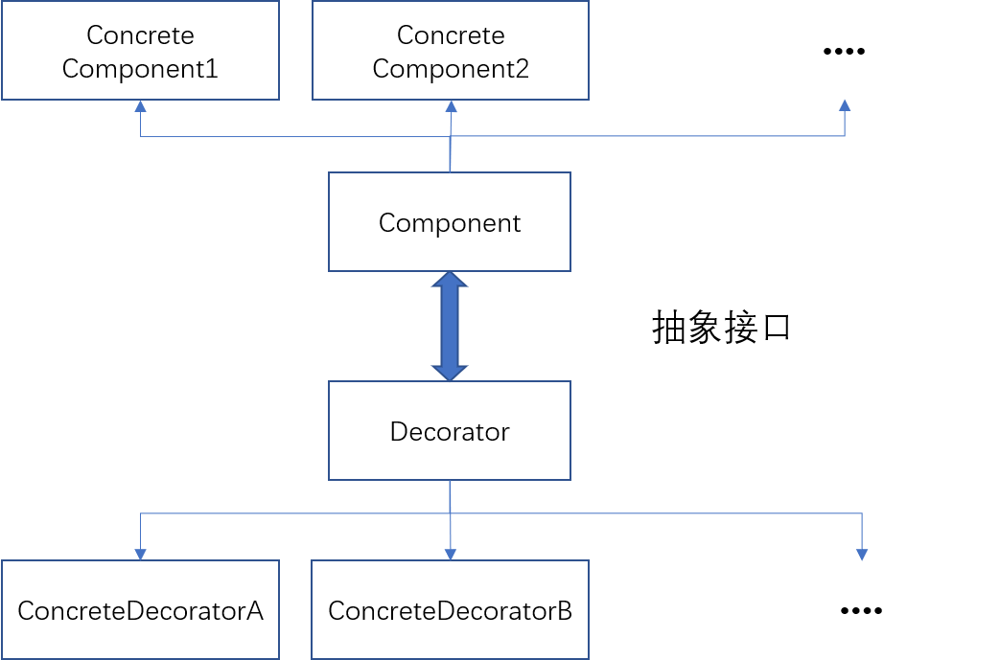
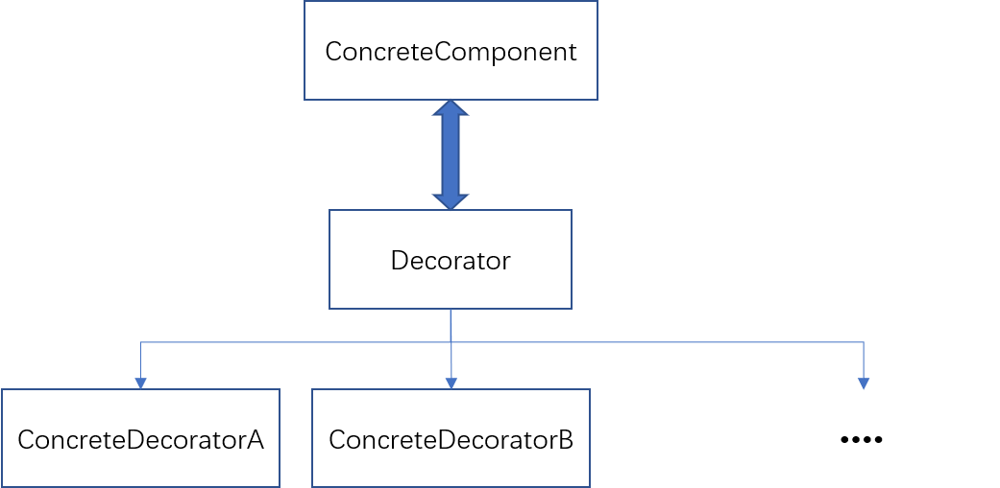

装饰器
=====
动态地给对象添加一些额外的职责，将类的核心职责与装饰工能分开，并且可以去除相关类中重复的装饰逻辑

```cpp
// 为 Component 添加装饰器
class Component{
public:
    Component() {//my code}
    virtual ~Component() {//my code}
    virtual void Operation();
}

class ConcreateComponent: public Component{
public:
    void Operation(){ // my code}
}

// 装饰器
class Decorator: public Component{
protected:
    Component _component;
public:
    void SetComponent(const Component& component){
        _component = component;
    }

    void Operation(){
        if(_component != NULL){
            _component.Operation();
        }
    }
}

class ConcreateDecoratorA: public Decorator{
private:
    string _state;
public:
    void Operation(){
        Decorator::Operation();
        state = "DecoratorA";
    }
}

class ConcreateDecoratorB: public Decorator{
private:
    void addBehavior(){}
public:
    void Operation(){
        Decorator::Operation(); 
        addBehavior();
    }
}

// 客户端代码
void main(){
    ConcreteComponent* c = new ConcreteComponent;
    ConcreateDecoratorA* da = new ConcreateDecoratorA;
    ConcreateDecoratorB* db = new ConcreateDecoratorB;
    da->SetComponent(c);
    db->SetComponent(da);
    db->Operation();
    delete c;
    delete da;
    delete db;
}
```


当被装饰的对象只有一个时，退化为下图结构



