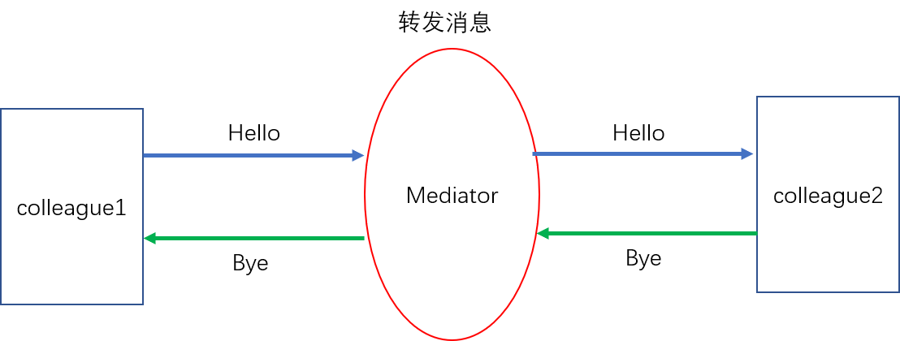

中介者模式
=========
用一个中介对象来封装一系列的对象交互，中介者使各对象不需要显式的相互引用，从而使其耦合松散，而且可以独立的改变它们之间的交互

**<center>中介者模式结构图</center>**


示例代码描述了下图过程


```cpp
// 中介者
class Mediator{
public:
    Mediator() {}
    virtual ~Mediator() {}

    virtual void Send(const string& message, Colleague* colleague); // 给两个对象分别发送消息
}

class ConcreteMediator: public Mediator{
private:
    ConcreteColleague1* _colleague1;
    ConcreteColleague2* _colleague2;
public:
    ConcreteMediator(){
        _colleague1 = nullptr;
        _colleague2 = nullptr;
    }
    ~ConcreteMediator(){}

    void SetConcreteColleague1(ConcreteColleague1* colleague1){
        _colleague1 = colleague1;
    }

    void SetConcreteColleague2(ConcreteColleague2* colleague2){
        _colleague2 = colleague2;
    }

    void Send(const string& message, Colleague* colleague){
        if(colleague == _colleague1){
            _colleague2->Notify(message);
        }
        else{
            _colleague1->Notify(message);
        }
    }
}

// 中介者的介入对象们
class Colleague{
protected:
    Mediator* _mediator;
public:
    Colleague(Mediator* mediator){
        _mediator = mediator;
    }
    ~Colleague() {}

    virtual Send(const string& message) {}
    virtual Notify(const string& message) {}
}

class ConcreteColleague1: public Colleague{
public:
    ConcreteColleague1(Mediator* mediator):Colleague(mediator){}
    ~ConcreteColleague1(){}

    void Send(const string& message){
        _mediator->Send(message, this);
    }
    void Notify(const string& message){//my code}
}

class ConcreteColleague2: public Colleague{
public:
    ConcreteColleague2(Mediator* mediator):Colleague(mediator){}
    ~ConcreteColleague2(){}

    void Send(const string& message){
        _mediator->Send(message, this);
    }
    void Notify(const string& message){//my code}
}

// 客户端代码
void main(){
    ConcreteMediator* m = new ConcreteMediator;
    ConcreteColleague1* c1 = new ConcreteColleague1(m);
    ConcreteColleague2* c2 = new ConcreteColleague2(m);
    
    m->SetConcreteColleague1(c1);
    m->SetConcreteColleague2(c2);

    c1->Send("hello");
    c2->Send("Bye");

    delete m;
    delete c1;
    delete c2;
}
```
由于ConcreteMediator控制了集中化，于是将交互复杂性变成了中介者的复杂性，使得中介者会变得比任何一个ConcreteColleague更加复杂
中介模式一般应用于一组对象以定义良好但是复杂的方式进行通信的场合