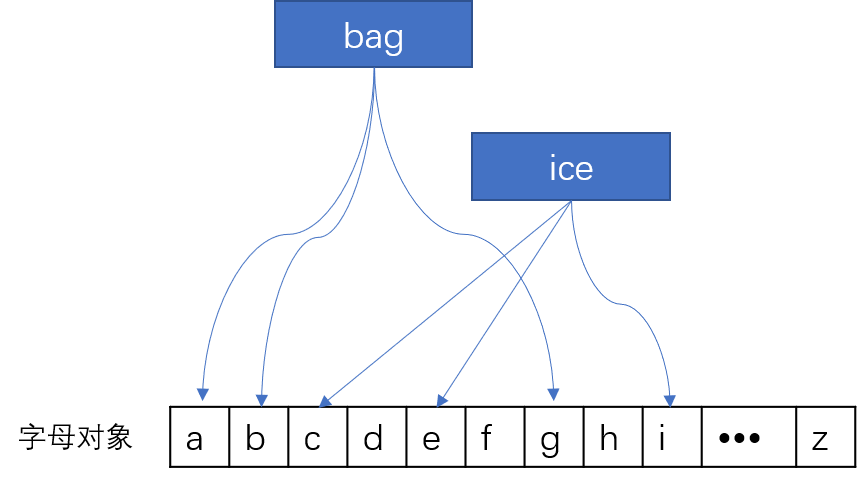

享元型
======
运用共享技术有效的支持大量细粒度的对象

**<center>享元模式结构图</center>**


```cpp
class Flyweight{
public:
    Flyweight() {}
    ~Flyweight() {}
    virtual void Operation(int extrinsicstate){}
}

class ConcreteFlyweight: public Flyweight{
public:
    ConcreteFlyweight() {}
    ~ConcreteFlyweight() {}
    void Operation(int extrinsicstate){}
}

class UnsharedConcreteFlyweight: public Flyweight{
public:
    UnsharedConcreteFlyweight() {}
    ~UnsharedConcreteFlyweight() {}
    void Operation(int extrinsicstate){}
}

class FlyweightFactory{
private:
    unordered_map<string, ConcreteFlyweight*> _hashFlyweight;
public:
    FlyweightFactory(){
        _hashFlyweight["X"] = new ConcreteFlyweight;
        _hashFlyweight["Y"] = new ConcreteFlyweight;
    }
    ~FlyweightFactory(){}

    Flyweight* GetFlyweight(const string& key){
        auto it = _hashFlyweight.find(key);
        if(it == _hashFlyweight.end())
            return nullptr;
        return it->second;
    }
}

//
void main(){
    int extrinsicstate = 22;
    FlyweightFactory* f = new FlyweightFactory;

    Flyweight* fx = f->GetFlyweight("X");
    fx->Operation(--extrinsicstate);

    Flyweight* fy = f->GetFlyweight("Y");
    fy->Operation(--extrinsicstate);

    UnsharedConcreteFlyweight* uf = new UnsharedConcreteFlyweight;
    uf->Operation(--extrinsicstate);

    delete f;
    delete uf;
}
```
在享元对象内部并且不会随环境改变而改变的共享部分称为享元对象的**内部状态**，而随环境改变而改变的，不可共享的状态称为**外部状态**。享元模式可以避免大量非常相似类的开销。
在程序设计中有时需要用大量细粒度的类的实例来表示数据，这时可以将某些参数移到类外，在方法调用时传递进来，就可以通过共享大幅度减少单个实例的数目。即若一个应用程序使用了大量的对象，而这些对象的大多数状态可以由外部状态设置时，就可以考虑利用享元模式来共享对象

举例文本中的单词

